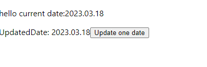

<!--Category:C#--> 
 

    <a href="http://productivitytools.tech/"><a> 
    

    

# Node date webhost

This is a simple example of referencing my own npm package.

<!--more-->

Page is simple: it invokes method from the package and prints it on the screen.

